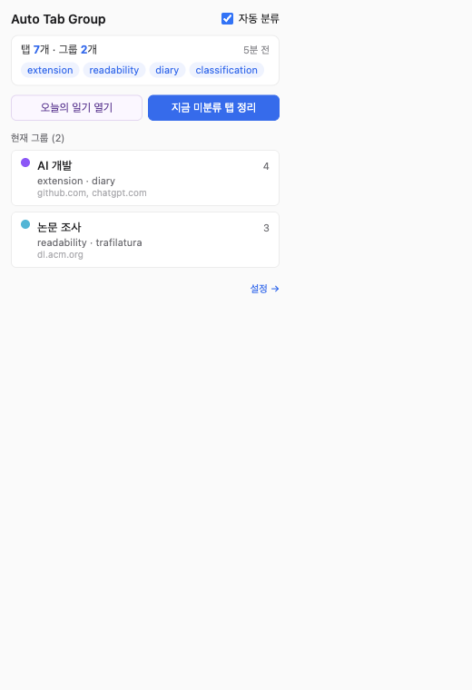
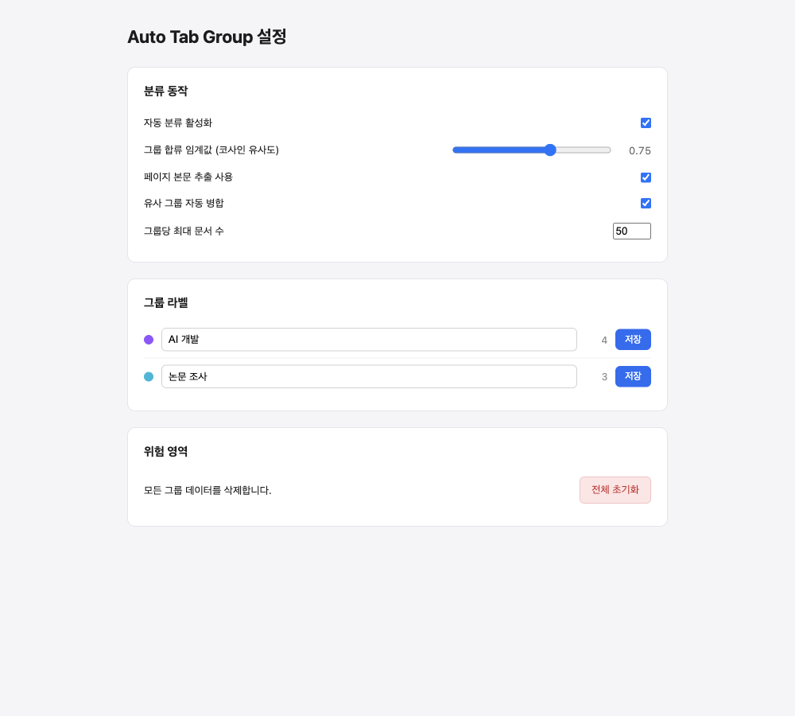
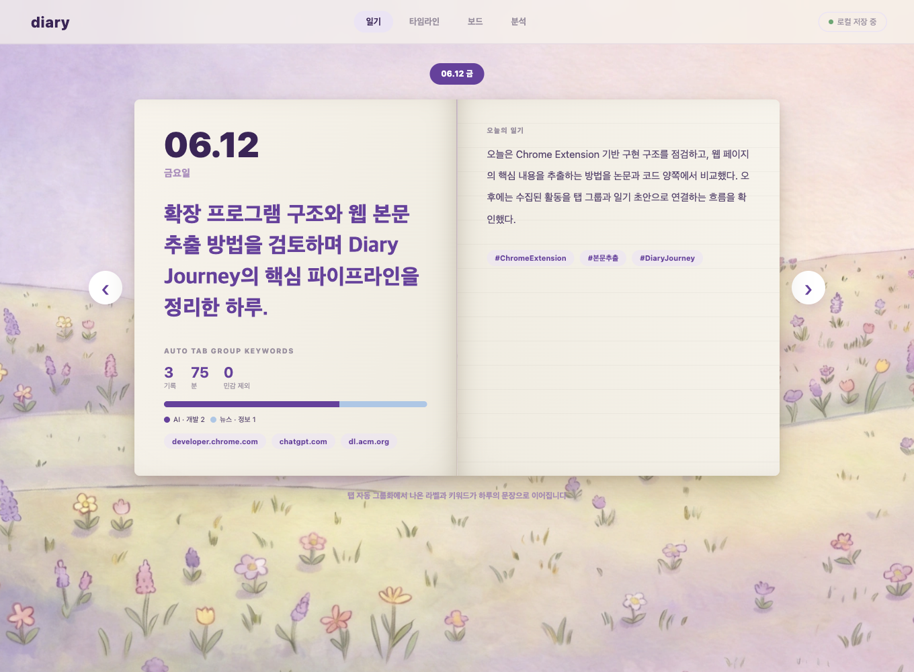

# 공개 SW 프로젝트 결과보고서

## 1. 기본 정보

| 구분 | 내용 |
| --- | --- |
| **프로젝트명** | Diary Journey: 브라우저 활동 기반 자동 탭 그룹화 및 일기 생성 Chrome 확장 |
| **교과목명** | 공개 SW 프로젝트 02분반 |
| **담당교수** | 제출 양식에 별도 기재 |
| **팀명** | 1조 |
| **팀장** | 최승범 |
| **팀원** | 박예준, 서희용, 조서연 |
| **주요 결과물** | `dist/` Chrome 확장 빌드, `src/` 구현 코드, `report.md` 결과보고서 |
| **검증 일자** | 2026-06-12 |

---

## 2. 결과보고서 요약

| 항목 | 내용 |
| --- | --- |
| **추진배경 및 필요성** | 현대 사용자는 웹 검색, 생성형 AI, 문서, 영상 등 다양한 브라우저 활동을 통해 정보를 소비하지만, 하루가 끝난 뒤 “무엇을 왜 찾아봤는지”를 다시 정리하는 데 큰 비용이 든다. 본 프로젝트는 브라우저 활동을 자동으로 수집·분류하고, 이를 일기 형식의 회고 자료로 전환하는 것을 목표로 한다. |
| **최종 목적 및 세부 목표** | Chrome 확장 프로그램으로 탭의 제목, URL, 본문 일부, AI 채팅 페이지 내용을 추출하고 임베딩 기반 유사도로 자동 그룹화한다. 그룹 라벨, 키워드, 히스토리 기반 에피소드를 다이어리 UI로 제공해 사용자가 하루 활동을 검토할 수 있도록 한다. |
| **핵심 성과** | 본문 추출, 다국어 임베딩 기반 탭 그룹화, URL 변경 재분류, 유사 그룹 병합, 다이어리 에피소드 기록을 하나의 Manifest V3 Chrome 확장 프로토타입 안에서 연결하였다. |
| **기대효과** | 정보 재탐색 시간 절감 기대, 사용자의 AI·웹 활용 패턴 회고, 활동 기록의 맥락화, 개인 지식 자산화 |
| **키워드(국문)** | 브라우저 기록, 자동 탭 그룹화, 본문 추출, 일기 생성, 개인 지식 관리 |
| **키워드(영문)** | Browser History, Auto Tab Grouping, Content Extraction, Diary Generation, Personal Knowledge Management |

---

## 목차

1. 프로젝트 과제의 필요성
2. 프로젝트 목적 및 내용
3. 추진 일정 및 전략
4. 활용 방안 및 기대효과
5. 참여 인력
6. 검증 결과
7. 참고문헌

---

## 제1장 프로젝트 과제의 필요성

### 제1절 과제 개요 및 추진 배경

초기 기획은 “AI를 이용해 브라우저 기록을 일기 초안으로 바꾸는 앱”이었다. 3월 27일 회의에서 지도교수는 단순 방문 기록보다 ChatGPT, Claude, Gemini 같은 AI 대화 기록과 사용자의 의식 흐름을 함께 다루는 방향이 더 의미 있다고 피드백하였다. 이에 팀은 브라우저 기반 AI 서비스의 DOM 변화와 일반 웹 활동을 함께 수집하는 방향을 검토했다.

중간 과정에서는 접근성 트리 diff, Playwright 기반 브라우저 모니터링, 로컬 LLM 요약 등을 실험했다. 그러나 한 페이지에서 수천 줄의 diff가 발생하고, 로컬 모델의 품질과 처리량이 부족하며, 프론트엔드와 백엔드 데이터 단위가 맞지 않는 문제가 확인되었다. 이후 회의와 발표 자료를 바탕으로 범위를 Chrome 확장 프로그램으로 조정하고, “활동 수집 → 의미 기반 그룹화 → 요약/다이어리 UI”에 집중하였다.

이 전환은 단순한 범위 축소가 아니라 문제 정의의 구체화였다. 초기 아이디어가 “브라우저 전체를 관찰해 일기를 만든다”에 가까웠다면, 최종 구현은 “현재 사용자가 실제로 열어 둔 탭과 최근 방문 기록을 의미 단위로 묶고, 그 결과를 회고 가능한 형태로 보여준다”로 좁혀졌다. 사용자가 직접 작성하는 일기 대신, 사용자가 이미 남긴 웹 활동의 흔적을 구조화된 재료로 바꾸는 방향이다.

웹 활동 데이터는 검색어, 방문 URL, 페이지 제목, 본문 일부, AI 대화 흐름 등 서로 다른 단위가 섞여 있다. 단순 시간순 목록은 사용자가 언제 무엇을 봤는지는 보여주지만, 여러 페이지가 같은 문제 해결 과정에 속하는지, AI 대화와 문서 탐색이 같은 주제인지, 짧은 검색 세션이 나중에 어떤 작업으로 이어졌는지는 설명하지 못한다. 따라서 본 프로젝트의 핵심 필요성은 기록 저장 자체가 아니라 기록의 맥락화에 있다.

웹 검색으로 확인한 관련 연구도 같은 방향을 뒷받침한다. Web Historian은 브라우저 기록을 사용자가 이해할 수 있는 시각 자료로 바꾸는 Chrome 확장 접근을 제시했고, 웹 브라우징 데이터 분석 가이드는 원자료 전처리, 필터링, 방문 분류, 행동 모델링의 단계를 강조한다. 또한 웹 본문 추출 연구는 HTML 문서에서 내비게이션, 광고, 추천 영역을 제거하고 핵심 본문을 얻는 일이 오래된 연구 문제임을 보여준다. 이 프로젝트는 그러한 연구 흐름을 학생 팀 프로젝트 수준에서 적용 가능한 범위로 구현한 사례이다.

### 제2절 과제 목적 및 내용

본 과제의 목적은 사용자가 직접 정리하지 않아도 브라우저 활동의 큰 흐름을 자동으로 묶고, 하루 단위 회고의 재료를 제공하는 것이다. 기존 AI에게 페이지 요약을 요청하는 방식과 달리, 확장 프로그램은 사용자가 활동하는 동안 백그라운드에서 자료를 모으고 그룹화한다.

구현 범위는 다음과 같다.

- Chrome Manifest V3 기반 확장 구조 설계
- 탭 제목, URL, 본문 일부(snippet), 제목 구조(heading) 기반 콘텐츠 추출
- ChatGPT, Claude, Gemini, 검색엔진용 사이트별 추출기 구현
- `Xenova/multilingual-e5-small` 임베딩과 코사인 유사도 기반 탭 그룹화
- 시간·도메인 가중치를 포함한 복합 점수화
- URL 변경 및 SPA 변화 감지 후 재분류
- 팝업, 옵션, 다이어리 UI 제공
- 히스토리 backfill 및 민감 정보 필터가 포함된 다이어리 에피소드 생성

### 제3절 과제 범위

사업적 측면에서는 개인 기록, 연구·학습 기록, 개발자 브라우징 세션 정리, AI 활용 회고를 지원하는 생산성 도구를 목표로 한다. 초기에는 기술직·학생처럼 정보 탐색 빈도가 높은 사용자를 1차 대상으로 보았으나, 회의 피드백을 반영해 “정보를 다루는 모든 사용자”로 확장 가능성을 열어두었다.

연구적 측면에서는 완전한 로컬 LLM 시스템보다 검증 가능한 브라우저 확장 아키텍처와 본문 추출, 임베딩 기반 분류, 사용자 검토 가능성을 우선했다. 보안 측면에서는 시크릿 탭, 내부 URL, localhost 등은 제외하고, 민감 카테고리 필터를 두어 무분별한 기록화를 줄였다.

구현 범위는 명확히 “개인 사용자의 로컬 브라우저 활동 보조”에 맞추었다. 최종 결과물은 Chrome 확장 프로그램 내부에서 동작하는 기능으로 한정하고, 실제 구현된 핵심 루프를 중심으로 정리했다. 핵심 루프는 페이지 열림 감지, 콘텐츠 추출, 임베딩 생성, 기존 그룹과 비교, Chrome 탭 그룹 반영, 저장소 갱신, 팝업 및 다이어리 표시 순서로 구성된다.

또한 본 프로젝트는 사용자의 모든 활동을 완전하게 해석한다고 주장하지 않는다. 페이지 본문을 800~900자 수준으로 제한하고, 방문 시간은 현재 구현에서 1분 단위 추정값으로 기록한다. 이 제한은 개인정보 노출과 저장량을 줄이기 위한 선택이기도 하지만, 동시에 보고서에서 명시해야 하는 기술적 한계이다. 최종 결과물은 완성형 개인 분석 서비스라기보다, 자동 탭 그룹화와 다이어리 생성 가능성을 검증하는 공개 SW 프로토타입이다.

### 제4절 선행 자료와 기술적 근거

웹 활동을 다루는 도구는 크게 세 계열로 나눌 수 있다. 첫째는 Chrome 방문 기록처럼 URL과 방문 시간을 보여주는 기본 브라우저 기능이다. 둘째는 Web Historian처럼 기록을 시각화해 사용자가 자신의 웹 사용 습관을 이해하게 돕는 도구이다. 셋째는 본 프로젝트처럼 브라우저 확장 내부에서 콘텐츠 추출, 의미 임베딩, 자동 분류를 결합해 사용 중인 탭 자체를 정리하는 방식이다.

본 프로젝트가 세 번째 방식을 택한 이유는 사용자의 업무 맥락이 “방문 기록”보다 “현재 열려 있는 작업 묶음”에 더 가깝기 때문이다. 예를 들어 사용자가 TypeScript 오류를 해결하기 위해 GitHub issue, Stack Overflow, 공식 문서, ChatGPT 대화를 동시에 열어 둔다면, 이들은 서로 다른 도메인이지만 하나의 문제 해결 세션에 속한다. 반대로 같은 도메인의 여러 페이지라도 요리 레시피와 장보기 페이지처럼 다른 목적일 수 있다. 따라서 도메인이나 시간만으로는 충분하지 않고, 페이지 제목과 본문 일부를 이용한 의미 비교가 필요하다.

웹 본문 추출 쪽에서는 Trafilatura, Web2Text, BoilerNet, SIGIR 2023 비교 연구를 참고했다. 이 연구들은 웹 페이지가 기계적으로는 HTML 구조를 갖지만 실제 분석에 필요한 본문은 광고, 메뉴, 댓글, 추천 영역과 섞여 있음을 보여준다. 최종 코드는 대규모 학습 모델을 새로 만들지는 않았지만, `article`, `main`, `[role="main"]` 우선 탐색, 링크 밀도, 문단 수, class/id 패턴, 텍스트 길이 점수화를 적용해 연구에서 제기한 boilerplate 문제를 실용적으로 줄였다.

임베딩 모델은 브라우저 환경에서 실행 가능한 Transformers.js와 `Xenova/multilingual-e5-small`을 사용했다. Multilingual E5 연구는 다국어 텍스트 쌍을 이용한 대조 학습 기반 임베딩 모델을 제시하며, 검색·분류·클러스터링처럼 단일 벡터 표현이 필요한 과제에 적합하다. 한국어와 영어 자료가 섞이는 학생·개발자 브라우징 환경을 고려하면, 다국어 임베딩은 단순 키워드 매칭보다 프로젝트 목적에 더 부합한다.

---

## 제2장 프로젝트 목적 및 내용

### 제1절 프로젝트의 최종 목적

최종 결과물은 `Auto Tab Group (BerTopic)` Chrome 확장과 Diary Journey UI이다. 사용자가 웹 페이지를 열면 콘텐츠 스크립트가 페이지의 핵심 텍스트를 추출하고, 백그라운드 서비스 워커가 임베딩을 생성해 기존 그룹 중심 벡터(centroid)와 비교한다. 유사도가 기준값을 넘으면 Chrome 탭 그룹에 합류시키고, 그렇지 않으면 새 그룹을 만든다. 이후 그룹 기록은 팝업 요약과 다이어리 에피소드로 연결된다.

사용자 관점의 최종 목적은 세 가지이다. 첫째, 현재 브라우저에 흩어진 탭을 주제별로 자동 정리한다. 둘째, 탭 그룹의 라벨, 키워드, 도메인, 최근 문서 제목을 통해 사용자가 왜 그 탭을 열어 두었는지 빠르게 회상하게 한다. 셋째, 하루 단위 활동을 다이어리 에피소드로 축적해 학습·업무 회고에 활용할 수 있게 한다.

시스템 관점의 최종 목적은 브라우저 이벤트 기반 자동 분류 파이프라인을 완성하는 것이다. 구현 코드는 `src/content`에서 페이지 본문을 추출하고, `src/background`에서 분류·저장·요약·다이어리 생성을 처리하며, `src/popup`, `src/options`, `src/diary`에서 사용자가 결과를 확인하고 조정하도록 구성되어 있다. 이 구조는 Chrome Manifest V3의 service worker, content script, popup/options page 구성을 따른다.

### 제2절 세부 목표와 달성 내용

| 세부 목표 | 구현 내용 | 달성 수준 |
| --- | --- | --- |
| 브라우저 활동 수집 | `tabs`, `webNavigation`, `history`, content script 사용 | 달성 |
| 콘텐츠 추출 | 일반 페이지 DOM scoring, 검색엔진/AI 채팅 사이트별 extractor | 달성 |
| 자동 그룹화 | E5 임베딩, 코사인 유사도, 최근 활동성/도메인 점수, 중심 벡터 갱신 | 달성 |
| URL 변경 재분류 | history API patch, MutationObserver, URL-change reclassification | 달성 |
| 사용자 조정 | 옵션 페이지에서 임계값, 본문 추출, 자동 병합, 라벨 수정 | 달성 |
| 일기화 | 히스토리 backfill, episode 분류, 일 단위 일기 생성, 주간 집계/보드/분석 표시, Gemini API 키 설정 | 부분 달성 |

달성 수준에서 “부분 달성”으로 표시한 일기화 항목은 기능이 전혀 없다는 의미가 아니다. `src/background/diary.ts`에는 분류된 탭을 `DiaryEpisode`로 기록하고, Chrome history를 최근 최대 30일 범위에서 backfill하며, 일별·주별 통계와 추천 문장을 생성하는 로직이 구현되어 있다. 다만 Gemini API를 통한 자연어 일기 생성은 사용자가 API 키를 설정해야 하는 선택 기능이고, 실제 배포 전 개인정보 안내와 API 키 보관 정책을 더 정리해야 하므로 부분 달성으로 판단하였다.

초기에는 Electron 기반 독립 앱도 검토했지만 최종 구현에는 포함하지 않았다. 접근성 트리 diff 기반 전체 브라우저 감시는 데이터가 지나치게 크고 노이즈가 많았고, 실제 코드에서는 Chrome 확장의 현재 탭과 확장 저장소를 중심으로 기능을 구현했다.

공개 SW 수업 목표와의 연결성을 기준으로 보면, 본 프로젝트의 성과는 기존 공개 소프트웨어를 단순히 사용하는 데 그치지 않고 공개 API·라이브러리·모델을 조합해 새로운 사용 흐름을 만든 데 있다. 활용한 공개 SW와 팀 자체 구현 범위는 다음과 같다.

| 구분 | 활용 요소 | 프로젝트 내 역할 |
| --- | --- | --- |
| 공개 API | Chrome Extension Manifest V3, `tabs`, `tabGroups`, `webNavigation`, `history`, `storage` | 브라우저 이벤트 수집, 탭 그룹 반영, 로컬 상태 저장 |
| 공개 라이브러리 | React, Vite, CRXJS, TypeScript | popup/options/diary UI와 확장 빌드 환경 구성 |
| 공개 모델/런타임 | Transformers.js, `Xenova/multilingual-e5-small` | 브라우저 환경에서 다국어 의미 임베딩 생성 |
| 팀 자체 구현 | 본문 추출 휴리스틱, 사이트별 extractor, 복합 점수화, URL 재분류, 다이어리 에피소드 | 프로젝트의 핵심 기능과 사용자 경험 구현 |

### 제3절 개발 및 연구 내용

#### 1. 확장 프로그램 구조

`manifest.config.ts`는 Manifest V3, service worker, content script, popup, options page를 정의한다. 주요 권한은 `tabs`, `tabGroups`, `storage`, `scripting`, `webNavigation`, `history`이며, Hugging Face 모델과 Gemini API 사용 가능성을 위해 관련 host permission을 포함한다.

세부 구조는 다음과 같다.

| 영역 | 주요 파일 | 역할 |
| --- | --- | --- |
| Manifest/빌드 | `manifest.config.ts`, `vite.config.ts` | MV3 확장 구성, CRX/Vite 빌드 설정 |
| 콘텐츠 수집 | `src/content/extract.ts`, `src/content/core-content.ts`, `src/content/site-extractors/*` | 페이지 제목, URL, 본문, heading, AI 채팅/검색 결과 추출 |
| 변화 감지 | `src/content/observers.ts`, `src/background/service-worker.ts` | DOM 변화, history API 변화, URL 변경 이벤트 감지 |
| 의미 분류 | `src/background/embedder.ts`, `src/background/scoring.ts`, `src/background/classifier.ts` | passage 생성, 임베딩, 그룹 점수화, 그룹 생성/합류/병합 |
| 저장소 | `src/background/storage.ts`, `src/shared/types.ts` | 그룹, 탭 상태, 설정, 다이어리 데이터 타입과 저장 |
| 다이어리 | `src/background/diary.ts`, `src/diary/main.tsx` | 에피소드 기록, history backfill, 일·주 단위 분석 UI |
| 사용자 UI | `src/popup/main.tsx`, `src/options/main.tsx` | 현재 그룹 요약, 수동 재그룹화, 설정 변경, 라벨 수정 |

Chrome 공식 문서 기준 Manifest V3는 백그라운드 페이지 대신 필요할 때 실행되는 service worker를 사용한다. 본 프로젝트도 `background.service_worker`를 `src/background/service-worker.ts`로 지정해 설치·시작·탭 업데이트·웹 내비게이션·런타임 메시지를 모두 이 파일에서 처리한다. 이는 확장 프로그램이 브라우저 내부 이벤트에 반응하는 구조와 잘 맞는다.

#### 2. 콘텐츠 추출

일반 페이지는 `article`, `main`, `[role="main"]` 같은 의미 태그(semantic tag)를 우선 탐색하고, 실패하면 텍스트 길이, 문단 수, 링크 밀도(link density), class/id 패턴을 점수화해 핵심 DOM 영역을 고른다. ChatGPT, Claude, Gemini, 검색엔진은 구조가 다르므로 별도 추출기(extractor)를 두었다. SPA 변화는 `MutationObserver`와 5초 debounce로 감지한다.

구현상 콘텐츠 추출은 두 단계로 동작한다. 첫 번째 단계는 사이트별 추출이다. `src/content/extract.ts`는 현재 호스트가 AI 채팅 서비스 또는 검색엔진인지 판별하고, 해당하면 `pickExtractor()`를 통해 ChatGPT, Claude, Gemini, 검색엔진 전용 추출기를 실행한다. 이때 page type은 `ai-chat` 또는 `search`로 기록되고, snippet 길이에 따라 추출 신뢰도는 0.85 또는 0.5로 부여된다.

두 번째 단계는 일반 웹 페이지 추출이다. `src/content/core-content.ts`는 heading을 최대 5개 수집한 뒤 `article`, `main`, `[role="main"]` 순서로 의미 태그를 확인한다. 텍스트가 200자 이상이고 링크 밀도가 0.5 미만이면 핵심 영역으로 판단한다. 의미 태그가 충분하지 않으면 `div`, `section`, `article`, `main` 후보를 돌며 텍스트 길이, 문단 수, 태그 종류, class/id 패턴, 링크 밀도, 화면 폭을 점수화한다. 이 방식은 완전한 논문 구현은 아니지만, 본문 추출 연구가 지적한 “본문과 boilerplate 분리” 문제를 코드 수준에서 반영한다.

추출 결과는 `ExtractedContent` 타입으로 정규화된다. 이 타입에는 `title`, `url`, `contentSnippet`, `headings`, `pageType`, `extractionSource`, `extractionConfidence`가 포함된다. 이처럼 출처와 신뢰도를 함께 저장하는 이유는 분류 단계에서 불확실한 본문이 그룹 이동을 과도하게 유발하지 않도록 하기 위해서이다. 실제로 `src/background/scoring.ts`는 `extractionConfidence`가 낮으면 총점을 약간 낮추는 방식으로 반영한다.

#### 3. 자동 그룹화

텍스트는 `passage: {title} | {domain} | {snippet}` 형식으로 구성하고 `Xenova/multilingual-e5-small`로 임베딩한다. 그룹 점수는 의미 유사도(semantic) 80%, 최근 활동성(temporal) 10%, 도메인 일치도(domain) 10%를 반영한다. 이는 회의에서 논의된 “코사인 민감도만으로는 케이스별 편차가 크다”는 문제를 보완하기 위한 설계이다.

실제 passage 구성은 제목의 비중을 높이도록 설계되어 있다. `src/background/embedder.ts`의 `buildPassageText()`는 제목을 두 번 반복하고, heading 최대 3개, 도메인, snippet을 결합한 뒤 E5 모델의 사용 방식에 맞춰 `passage:` prefix를 붙인다. 검색엔진 페이지는 도메인 자체가 구글·네이버 등으로 편향될 수 있으므로 도메인 포함을 제한한다. 이는 같은 검색엔진 안에서 전혀 다른 검색 의도를 같은 그룹으로 묶는 문제를 줄이기 위한 선택이다.

임베딩은 `@huggingface/transformers`의 `pipeline("feature-extraction", "Xenova/multilingual-e5-small")`로 생성하며, mean pooling과 normalize 옵션을 사용한다. 정규화된 벡터에서는 두 벡터의 내적이 코사인 유사도로 동작하므로, `cosineSimilarity()`는 별도 norm 계산 없이 dot product를 계산한다. 이렇게 만든 벡터는 그룹의 centroid와 비교되고, 문서가 추가될 때마다 `updateCentroid()`로 중심 벡터를 갱신한다.

그룹 점수화는 다음 식으로 요약할 수 있다.

```text
total = (semantic * 0.80 + temporal * 0.10 + domain * 0.10) * confidenceFactor
```

`temporal`은 최근 30분 안에 활동한 그룹일수록 높은 값을 갖고, `domain`은 해당 도메인이 그룹 내 문서에서 자주 등장할수록 높아진다. 이 설계는 같은 주제를 짧은 시간 안에 연속 탐색하는 실제 브라우징 패턴을 반영한다. 반면 오래전에 만든 그룹이나 도메인이 맞지 않는 그룹은 의미 유사도가 조금 높더라도 총점에서 불리해진다.

분류 결과는 네 가지로 나뉜다. 기준값 이상인 기존 그룹이 있으면 해당 Chrome 탭 그룹에 합류하고, 충분한 그룹이 없으면 새 그룹을 만든다. 이미 속한 그룹의 콘텐츠가 바뀌었으면 centroid만 갱신할 수 있다. URL 변경으로 기존 그룹과 더 이상 맞지 않으면 재분류 결정 로직에 따라 유지, 이동, 새 그룹 생성, 그룹 해제 중 하나를 선택한다.

#### 4. 다이어리 기능

탭 그룹화 결과와 Chrome history를 바탕으로 `DiaryEpisode`를 만든다. 카테고리는 AI·개발, 영상·엔터, 뉴스·정보, 요리·라이프, 민감으로 나뉜다. 민감 키워드와 도메인은 별도 필터를 적용한다. 사용자는 다이어리 화면에서 일별 요약, 타임라인, 보드, 분석 탭을 확인할 수 있다.

`recordDiaryEpisodeFromClassification()`은 탭이 그룹화될 때마다 현재 제목, URL, 도메인, snippet, 그룹 라벨, 키워드를 묶어 에피소드를 만든다. 같은 탭에서 같은 URL이 다시 분류되면 기존 에피소드를 찾아 갱신하고, URL이 달라지면 새 에피소드로 기록한다. 이 방식은 SPA 이동이나 같은 탭 안의 검색 흐름을 어느 정도 분리할 수 있게 한다.

`backfillHistory()`는 Chrome `history.search()`와 `history.getVisits()`를 이용해 최근 방문 기록을 가져온다. 내부 URL과 localhost는 제외하고, 제목·도메인·URL 토큰을 기존 그룹의 라벨/키워드와 비교해 가장 관련 있는 그룹에 연결한다. 연결할 수 없으면 `history-fallback`으로 저장한다. 방문 시간은 Chrome history의 visit time을 사용하고, 현재 프로토타입에서는 활동 지속 시간을 1분 추정값으로 기록한다.

일기 생성은 두 경로를 가진다. Gemini API 키가 있으면 외부 생성 모델을 사용할 수 있고, 없으면 규칙 기반 fallback으로 요약을 만든다. 규칙 기반 경로는 안전한 에피소드만 사용해 상위 그룹, 키워드, 도메인을 조합한다. 민감 에피소드는 통계에는 포함될 수 있지만 일기 문장 생성의 source episode에서는 제외된다. 따라서 사용자는 기록 기능을 켜더라도 민감 정보가 자연어 회고문에 직접 섞이는 위험을 줄일 수 있다.

### 제4절 구현 코드 기반 처리 흐름

전체 처리 흐름은 다음과 같다.

1. 사용자가 탭을 열거나 URL이 변경된다.
2. `service-worker.ts`가 `tabs.onUpdated`, `webNavigation.onHistoryStateUpdated`, `webNavigation.onReferenceFragmentUpdated` 이벤트를 감지한다.
3. 분류 대상이면 `requestExtract()`로 content script에 본문 추출을 요청한다.
4. content script가 사이트별 추출기 또는 `core-content`를 통해 `ExtractedContent`를 만든다.
5. service worker가 passage를 구성하고 임베딩을 생성한다.
6. `scoreGroups()`가 기존 그룹별 총점을 계산한다.
7. `classifyTab()`이 그룹 합류, 새 그룹 생성, centroid 갱신, 유사 그룹 병합을 수행한다.
8. `storage.ts`가 그룹과 탭 상태를 `chrome.storage.local`에 저장한다.
9. `diary.ts`가 분류 결과를 에피소드로 기록한다.
10. popup/options/diary UI가 메시지 기반으로 저장된 결과를 읽어 표시한다.

이 흐름에서 중요한 점은 content script와 service worker의 역할 분리이다. content script는 웹 페이지 DOM에 접근할 수 있지만 Chrome 탭 그룹 관리와 저장소 정책 전체를 책임지지 않는다. 반대로 service worker는 확장 권한을 통해 탭 그룹, 저장소, 히스토리를 다루지만 페이지 DOM에는 직접 접근하지 않는다. 두 영역은 `chrome.runtime.sendMessage()`로 연결된다.

또한 분류 작업은 debounce를 적용한다. 일반 탭 완료 이벤트는 300ms, URL 변경은 1000ms 지연 후 실행된다. 콘텐츠 변화 감지는 200자 이상의 본문 길이 변화가 누적될 때만 5초 debounce 후 재분류 메시지를 보낸다. 이 값들은 빠른 반응성과 불필요한 임베딩 호출 감소 사이의 절충이다. 특히 생성형 AI 채팅 페이지는 답변이 스트리밍되면서 DOM이 계속 바뀌므로, 변화가 있을 때마다 즉시 분류하면 모델 호출과 저장소 갱신이 과도하게 발생한다.

### 제5절 재분류와 그룹 병합 설계

초기 시연에서 확인된 중요한 문제는 “한 탭이 다른 주제로 이동했는데도 기존 그룹에 남는 현상”이었다. 예를 들어 사용자가 검색 결과 페이지에서 문서를 열거나, 같은 탭에서 ChatGPT 대화 주제를 바꾸면 탭의 의미가 달라진다. 이를 해결하기 위해 `TabState`에는 `lastUrl`, `lastEmbeddingHash`, `pendingReclassify`, `navigationVersion`, `urlDirty`가 저장된다.

URL 변경이 감지되면 `urlDirty`가 true가 되고, 다음 분류에서는 이미 그룹에 속한 탭도 재분류 대상이 된다. `decideReclassification()`은 현재 그룹 점수가 기준값을 넘으면 유지하고, 다른 그룹이 기준값을 넘으면 이동한다. 어느 그룹도 충분하지 않으면 새 그룹을 만들거나, 설정에 따라 기존 그룹에 남겨 둔다. 이는 사용자 경험 측면에서 매우 중요하다. 자동 분류가 잘못된 그룹에 탭을 오래 붙잡아 두면 사용자는 도구를 신뢰하기 어렵기 때문이다.

유사 그룹 병합은 또 다른 보완 장치이다. 새 그룹 생성이 너무 민감하면 같은 주제의 그룹이 여러 개 생긴다. `maybeMergeSimilarGroups()`는 상위 두 그룹의 semantic score가 모두 0.85 이상이고 차이가 0.08 이하일 때 병합 후보로 본다. 병합 시 source 그룹의 Chrome 탭을 target 그룹으로 이동하고, 문서 목록을 중복 제거한 뒤 centroid를 재계산한다. 라벨과 색상도 다시 계산하여 UI에 반영한다.

### 제6절 데이터 모델과 저장 정책

핵심 데이터 모델은 `src/shared/types.ts`에 정의되어 있다. `GroupRecord`는 Chrome group id, centroid, 문서 수, 문서 목록, 라벨, 색상, 생성/갱신 시간, 도메인 빈도를 가진다. `GroupDocument`는 tab id, 제목, URL, 도메인, snippet, 토큰, embedding, 수집 시간을 저장한다. `TabState`는 탭별 최근 URL과 그룹 키를 저장해 중복 임베딩과 잘못된 재분류를 줄인다.

다이어리 데이터는 `DiaryEpisode`, `DiaryEntry`, `DiaryDay`, `DiaryWeek`, `DiaryAnalysis`로 나뉜다. 에피소드는 가장 작은 활동 단위이고, 엔트리는 하루 회고문이며, Day/Week/Analysis는 UI 표시를 위한 집계 결과이다. 현재 구현은 이 구조를 이용해 일기, 타임라인, 보드, 분석 화면을 구성한다.

저장소는 `chrome.storage.local`을 사용한다. Chrome 공식 문서에서 storage API는 확장 프로그램의 사용자 데이터와 상태를 저장하기 위한 API로 설명된다. 본 프로젝트에서는 외부 서버 없이 로컬 확장 저장소에 그룹·탭·설정·다이어리 데이터를 저장한다. 다만 `host_permissions`가 `<all_urls>`로 넓게 잡혀 있고 Gemini API 키 입력 기능이 있으므로, 현재 결과물에는 권한 최소화와 키 저장 안내가 충분히 구현되어 있지 않다.

### 제7절 주요 결과물

#### 그림 1. 팝업 화면

그룹 수, 문서 수, 최근 키워드, 그룹별 라벨과 도메인을 빠르게 확인한다. 아래 이미지는 빌드된 React 번들에 검증용 데이터를 주입해 렌더링한 UI 확인 화면이다.



#### 그림 2. 옵션 화면

자동 분류 활성화, 그룹 합류 임계값, 본문 추출, 유사 그룹 자동 병합, 그룹당 최대 문서 수와 수동 라벨을 조정한다. 아래 이미지는 검증용 데이터 기반 UI 렌더링 화면이다.



#### 그림 3. 다이어리 화면

탭 그룹 라벨, 키워드, 도메인, 추정 활동 시간을 하루의 회고 문장으로 연결한다. 아래 이미지는 검증용 데이터 기반 UI 렌더링 화면이다.



---

## 제3장 추진 일정 및 전략

### 제1절 추진전략 및 방법

회의록 기준 프로젝트는 다음 흐름으로 진행되었다.

| 시기 | 주요 논의 및 개발 내용 |
| --- | --- |
| 3월 말 | 브라우저/AI 사용 기록을 일기 초안으로 만드는 초기 기획 확정 |
| 4월 초 | 접근성 트리 diff, URL 전환 감지, SQLite 저장 구조 실험 |
| 4월 중순 | 로컬 LLM 요약 한계, 노이즈 필터링 필요, UI 시나리오 보강 논의 |
| 5월 말 | Chrome 탭 그룹 기반 프로토타입 시연, 코사인 민감도와 재그룹화 문제 확인 |
| 6월 초 | 논문 기반 본문 추출/분류 전략 보강, URL 변경 재분류와 프론트 구현 집중 |
| 6월 12일 | 빌드 검증, 빌드 번들 UI 캡처, 결과보고서 작성 |

추진 전략은 “기반 기술 직접 구현”보다 검증된 브라우저 API와 오픈소스 모델을 조합하는 방식이었다. 지도교수 피드백처럼 완성도와 시연 가능성이 중요했기 때문에, 범위를 Electron 전체 앱에서 Chrome 확장으로 조정했다.

구체적인 개발 전략은 세 가지 원칙으로 정리할 수 있다. 첫째, 브라우저 활동 수집은 별도 네이티브 앱보다 확장 프로그램 API를 우선 사용했다. Chrome의 `tabs`, `tabGroups`, `webNavigation`, `history`, `storage` API를 쓰면 현재 탭 상태와 방문 기록을 같은 환경에서 다룰 수 있기 때문이다. 둘째, 의미 분류는 직접 학습 모델을 만들기보다 공개 임베딩 모델을 활용했다. 프로젝트 기간과 팀 규모를 고려하면 모델 학습보다 파이프라인 통합과 사용자 검토 UI 구현이 더 높은 우선순위였다. 셋째, 생성형 AI 의존도를 낮추었다. Gemini API 키가 없더라도 규칙 기반 다이어리 생성이 동작하도록 설계해 시연 안정성을 확보했다.

개발 과정에서 기술 선택은 여러 차례 수정되었다. 4월에는 SQLite와 독립 앱 구조가 논의되었지만, 확장 저장소와 Chrome history API만으로도 프로토타입 검증이 가능하다고 판단했다. 5월에는 코사인 유사도 기준만으로 탭을 묶는 방식의 한계가 드러났고, 6월에는 시간·도메인·본문 추출 신뢰도를 결합한 복합 점수 방식으로 보완했다. 최종 결과물은 이러한 시행착오를 반영해 “작지만 실제로 돌아가는 브라우저 확장”에 초점을 맞추었다.

### 제2절 추진체계

| 세부 개발 내용 | 기획 | 수집 실험 | 분류 구현 | UI 구현 | 검증/보고 |
| --- | :-: | :-: | :-: | :-: | :-: |
| 문제 정의 및 유사 서비스 분석 | ● |  |  |  |  |
| 브라우저 활동 수집 실험 | ● | ● |  |  |  |
| 본문/AI 채팅 추출 |  | ● | ● |  |  |
| 임베딩 기반 탭 그룹화 |  |  | ● |  |  |
| URL 변경 재분류 |  |  | ● |  | ● |
| 팝업/옵션 UI |  |  |  | ● | ● |
| 다이어리 UI 및 히스토리 backfill |  |  | ● | ● | ● |
| 발표 및 최종 보고서 |  |  |  |  | ● |

협업 과정은 회의록과 Git 커밋을 통해 기능 단위로 추적하였다. 회의록에는 지도교수 피드백, 범위 조정, 로컬 LLM 한계, 프론트-백엔드 연동 이슈가 기록되어 있고, Git 이력에는 SPA URL 변경 대응, 유사 그룹 병합, threshold 기반 재분류, 다이어리 히스토리 추적 같은 변경이 독립 커밋으로 남아 있다. 이는 단순 역할 분담을 넘어 공개 SW 개발환경에서 변경 목적과 구현 영향을 확인하며 협업한 근거가 된다.

### 제3절 위험 관리 및 의사결정

프로젝트에서 가장 큰 위험은 데이터 노이즈였다. 브라우저 화면 전체를 감시하면 버튼, 메뉴, 추천 콘텐츠, 광고, 스크롤 변화가 모두 기록될 수 있다. 이를 줄이기 위해 최종 구현은 접근성 트리 diff 대신 페이지 본문 추출과 DOM 변화 debounce를 사용했다. 또한 본문이 충분하지 않은 경우 `pendingReclassify` 상태로 두어 즉시 잘못된 그룹을 만들지 않도록 했다.

두 번째 위험은 분류 안정성이었다. 너무 낮은 임계값은 무관한 탭을 같은 그룹으로 묶고, 너무 높은 임계값은 같은 주제의 탭을 계속 새 그룹으로 만든다. 옵션 페이지에서 사용자가 threshold를 0.5~0.9 범위로 조정할 수 있게 한 이유가 여기에 있다. 그룹당 최대 문서 수, 유사 그룹 자동 병합, 본문 추출 사용 여부도 옵션으로 제공해 실험 중 확인된 케이스에 대응할 수 있게 했다.

세 번째 위험은 개인정보와 민감 정보이다. 본 프로젝트는 사용자의 브라우저 활동을 다루므로 과도한 수집을 피해야 한다. 코드에서는 내부 URL, 시크릿/로컬 환경, localhost를 제외하고, 다이어리에서는 금융·의료·비밀번호 관련 키워드와 도메인을 민감 카테고리로 분리한다. 다만 완전한 개인정보 보호 정책과 배포용 동의 화면은 현재 구현에 포함되지 않았다.

### 제4절 공개 SW 관점의 의의

공개 SW 프로젝트로서 본 결과물의 의의는 특정 벤더의 닫힌 기록 서비스가 아니라, 브라우저 API와 공개 모델, TypeScript/React 기반 구현을 조합해 재현 가능한 프로토타입을 만들었다는 점이다. 핵심 로직은 `src/background`와 `src/content`에 분리되어 있어 다른 팀원이 분류 기준, 추출기, UI를 독립적으로 개선할 수 있다. 예를 들어 검색엔진 추출기가 부족하면 `src/content/site-extractors/search-engine.ts`를 개선하고, 그룹 점수가 불안정하면 `src/background/scoring.ts`의 가중치를 조정할 수 있다.

또한 코드가 비교적 작은 모듈로 나뉘어 있어 학습용으로도 의미가 있다. Chrome extension의 event-driven 구조, content script와 service worker 간 메시지, 브라우저 저장소, 웹 본문 추출, 임베딩 기반 유사도 비교, React 기반 popup/options UI가 하나의 프로젝트 안에서 연결되어 있다. 이는 단순 화면 구현보다 공개 SW 프로젝트 수업의 목표인 실제 기술 통합 경험에 더 가깝다.

재현성 측면에서는 `package-lock.json`을 포함해 같은 의존성 조합으로 빌드할 수 있게 했고, `npm run build`에 포함된 `tsc --noEmit`과 Vite 빌드로 TypeScript/Vite 산출물 생성 가능성을 확인하였다. 공식 공개 저장소로 확장하려면 `LICENSE`, `CONTRIBUTING.md`, 보안 안내, 이슈/PR 템플릿을 추가해 외부 사용자가 사용 조건과 기여 절차를 명확히 알 수 있게 해야 한다. 현재 보고서는 이 항목을 완성 기능이 아니라 공개 배포 전 보완점으로 구분한다.

외부 기여 가능성은 작은 작업 단위로 나눌 수 있다. 예를 들어 사이트별 extractor 추가, 본문 추출 점수 조정, 권한 최소화, 수동 테스트 케이스 작성, 다국어 라벨링 품질 개선은 기존 구조를 크게 바꾸지 않고도 기여할 수 있는 영역이다. 이런 구조는 수업 이후에도 공개 SW 프로젝트로 발전할 수 있는 기반이 된다.

---

## 제4장 활용 방안 및 기대효과

### 제1절 기대효과 및 활용 가능성

본 프로젝트는 사용자가 다시 검색하거나 방문 기록을 뒤지는 시간을 줄일 수 있다. 또한 탭 그룹과 다이어리 요약을 통해 “무엇을 봤는가”뿐 아니라 “어떤 주제에 집중했는가”를 확인하게 한다. 현재 구현은 개인 브라우저 사용자의 탭 정리와 활동 회고에 초점을 맞춘다.

사용자는 평소처럼 브라우저를 사용하기만 해도 작업 흐름의 초안을 얻는다. 이는 회고 습관이 없는 사용자에게 특히 유용하다. 일기를 직접 쓰는 일은 부담스럽지만, 자동으로 정리된 키워드와 탭 그룹을 보고 “오늘은 어떤 문제를 해결하려 했는지” 확인하는 일은 상대적으로 낮은 비용으로 가능하다. 학습자에게는 공부 주제의 흐름을, 개발자에게는 버그 해결 과정의 참고 문서를, 연구자에게는 조사 경로를 남기는 도구가 될 수 있다.

### 제2절 기술적 측면

Chrome Extension, content script, service worker, Transformers.js, DOM 기반 본문 추출, MutationObserver, Chrome history API가 하나의 파이프라인으로 통합되었다. 특히 URL 변경 재분류, 그룹 중심 벡터 업데이트, 유사 그룹 병합은 단순 기록 도구보다 능동적인 분류 기능을 제공한다.

현재 scoring 가중치와 threshold는 규칙 기반이다. 본문 추출기도 휴리스틱 중심이며, 대규모 학습 기반 extractor를 직접 구현하지 않았다. 다이어리 생성은 Gemini API 키가 있을 때 외부 API를 사용하고, 키가 없을 때는 규칙 기반 fallback을 사용한다.

### 제3절 경제·산업적 측면

지식 노동자는 검색, 문서 읽기, AI 대화, 코드 참고를 반복한다. 이 과정을 자동 정리하면 업무 회고와 자료 재탐색 비용을 줄일 수 있다. 학습자에게는 공부 흐름 기록, 개발자에게는 프로젝트별 브라우징 세션 정리, 연구자에게는 논문·문서 조사 경로 정리 도구가 될 수 있다.

생성형 AI 사용이 늘어날수록 사용자는 ChatGPT, Claude, Gemini 대화와 일반 웹 검색을 함께 사용한다. 이때 대화 내용과 관련 문서를 같은 맥락으로 묶는 기능은 단순 북마크보다 높은 가치를 가진다. 현재 결과물은 개인 사용자의 Chrome 확장 프로토타입이다.

### 제4절 현재 결과물의 활용 범위

현재 구현된 범위에서 사용자는 Chrome에서 자동 탭 그룹화를 켜고, 팝업에서 그룹 요약과 키워드를 확인하며, 옵션 페이지에서 임계값·본문 추출·자동 병합·그룹 라벨을 조정할 수 있다. 다이어리 화면에서는 분류된 탭과 Chrome history 기반 에피소드를 일기, 타임라인, 보드, 분석 화면으로 확인할 수 있다. 이 활용 범위는 로컬 확장 저장소와 현재 브라우저 세션을 전제로 한다.

---

## 제5장 참여 인력

### 제1절 업무 분담

| 성명 | 담당분야 | 주요 수행 내용 | 참여도 |
| --- | --- | --- | :-: |
| 최승범 | 팀장, 발표, QA, 백엔드 구현 지원 | 일정 조율, 지도교수 피드백 정리, 발표 자료 구성, DOM 트리 활용 방안 및 재그룹화 검토 | 30% |
| 박예준 | PM, 메인 백엔드 개발 | 자동 탭 그룹화 시범 모델, 임베딩/분류 로직, 버그 수정, 프론트-백엔드 연결, 최종 코드 보강 | 25% |
| 서희용 | 분류 로직 설계 지원, 자료 조사 | 임베딩 및 시간·맥락 기반 로직 설계 보조, 논문 조사, 백엔드 시범 모델 검토 | 25% |
| 조서연 | 프론트엔드, UX/UI | 다이어리 UI 구상, 사용자 경험 설계, 인터페이스 구현 방향 정리 | 20% |

### 제2절 팀원별 수행 성과

최승범은 프로젝트 기획과 발표 흐름을 정리하고, 회의에서 나온 질문을 개발 과제로 환원하였다. 박예준은 Chrome 확장 백엔드와 탭 그룹화 로직, 재분류, 다이어리 연동 구현을 주도하였다. 서희용은 분류 기준과 논문 기반 타당성 확보에 기여하였다. 조서연은 초기 대시보드/다이어리 화면의 방향을 제안하고 사용자가 결과를 받아들이는 UI 흐름을 설계하였다.

---

## 제6장 검증 결과

### 제1절 빌드 검증

Node.js v24.14.0 환경에서 `npm run build`를 수행해 성공하였다. 빌드 결과 `dist/manifest.json`, service worker, popup/options/diary HTML, content script, WASM, 이미지 asset이 생성되었다.

```bash
npm run build
```

검증 결과: `tsc --noEmit && vite build` 통과.

빌드 검증의 의미는 두 가지이다. 첫째, TypeScript 타입 정의와 실제 구현 사이에 큰 불일치가 없음을 확인한다. 본 프로젝트는 `GroupRecord`, `TabState`, `DiaryEpisode`처럼 여러 모듈이 공유하는 타입이 많기 때문에 타입 검증이 중요하다. 둘째, Vite/CRX 빌드가 Manifest V3 확장 산출물로 변환되는지 확인한다. `dist/manifest.json`과 각 HTML entry point가 생성되어야 Chrome에서 압축 해제 확장 프로그램으로 로드할 수 있다.

주요 코드-기능 대응은 다음과 같이 확인하였다.

| 기능 주장 | 근거 파일 | 확인 내용 |
| --- | --- | --- |
| MV3 확장 구조 | `manifest.config.ts` | service worker, content script, popup, options, diary entry point 구성 |
| 페이지 본문 추출 | `src/content/extract.ts`, `src/content/core-content.ts` | AI 채팅/검색 사이트별 extractor와 일반 DOM scoring 병행 |
| DOM/SPA 변화 감지 | `src/content/observers.ts` | `MutationObserver`, `pushState`, `replaceState`, `popstate` 감지와 5초 debounce |
| 의미 기반 그룹화 | `src/background/embedder.ts`, `src/background/scoring.ts`, `src/background/classifier.ts` | E5 임베딩, cosine similarity, temporal/domain 가중치, centroid 갱신 |
| URL 변경 재분류 | `src/background/service-worker.ts`, `src/background/reclassification.ts` | `urlDirty` 상태, keep/move/create-new/defer 결정 |
| 유사 그룹 병합 | `src/background/classifier.ts` | semantic 0.85 이상, gap 0.08 이하 조건에서 Chrome 그룹 병합 |
| 다이어리 생성 | `src/background/diary.ts` | classified-tab episode, history backfill, 민감 필터, 일·주 분석 |
| 사용자 조정 UI | `src/popup/main.tsx`, `src/options/main.tsx` | 자동 분류 토글, threshold, 그룹 라벨, 전체 초기화, 수동 재그룹화 |

핵심 기능별 검증 범위는 다음과 같이 정리하였다. 실제 장시간 사용자 테스트나 정량 정확도 평가는 수행하지 않았으므로, 아래 결과는 빌드 통과와 코드 구조 확인, 빌드 번들 UI 렌더링 확인에 기반한다.

| 검증 대상 | 확인 기준 | 현재 확인 결과 |
| --- | --- | --- |
| 일반 웹 페이지 분류 | 본문 추출 결과가 임베딩 passage로 전달되는지 | `extract.ts`, `embedder.ts`, `classifier.ts` 흐름 확인 |
| AI 채팅/검색 페이지 추출 | 사이트별 extractor가 page type과 snippet을 만드는지 | ChatGPT/Claude/Gemini/search extractor 구현 확인 |
| 같은 주제 탭 그룹화 | E5 임베딩과 centroid 비교로 그룹 합류/생성이 가능한지 | semantic/temporal/domain 점수화 및 Chrome tabGroups 연동 확인 |
| URL 변경 재분류 | SPA/history URL 변경 후 기존 그룹 유지·이동·새 그룹 결정을 하는지 | `urlDirty`, `navigationVersion`, `decideReclassification()` 확인 |
| 유사 그룹 병합 | 높은 semantic score와 작은 gap 조건에서 병합하는지 | semantic 0.85 이상, gap 0.08 이하 조건 확인 |
| 다이어리 기록 | 분류 결과와 history backfill이 episode로 저장되는지 | classified-tab/history-backfill source 처리 확인 |
| 민감 정보 처리 | 민감 카테고리를 일기 생성 재료에서 제외하는지 | 민감 키워드/도메인 필터와 safe episode 필터 확인 |
| API 키 없음 경로 | Gemini 키 없이도 일기 문장이 생성되는지 | 규칙 기반 fallback 경로 확인 |

### 제2절 Chrome 로딩 시도 및 빌드 번들 UI 확인

Chrome 테스트 프로필에서 `--load-extension=dist` 방식으로 확장 로딩을 시도하고 DevTools Protocol 목록을 확인하였다. 테스트 중 Chrome의 로컬 확장 콘텐츠 검증으로 직접 확장 URL 캡처가 제한되어, 최종 보고서의 UI 이미지는 빌드된 React 번들을 동일하게 사용하되 `chrome.runtime.sendMessage`만 검증용 데이터로 대체한 화면이다. 따라서 이미지는 UI 흐름 검증용이며, 실제 기능 구현의 근거는 `src/` 코드와 빌드 결과에 둔다.

| 검증 항목 | 확인 방법 | 결과 |
| --- | --- | --- |
| TypeScript 및 Vite 빌드 | `npm run build` | 통과 |
| 확장 산출물 생성 | `dist/manifest.json`, service worker, content script 확인 | 생성 확인 |
| 팝업 UI 렌더링 | 빌드 번들 + 검증용 런타임 데이터 | 화면 확인 |
| 옵션 UI 렌더링 | 빌드 번들 + 검증용 런타임 데이터 | 화면 확인 |
| 다이어리 UI 렌더링 | 빌드 번들 + 검증용 런타임 데이터 | 화면 확인 |

팝업 화면은 `GET_GROUPS`, `GET_SETTINGS`, `GET_SUMMARY` 메시지 응답을 받아 그룹 수, 문서 수, 최근 키워드, 그룹별 도메인을 보여준다. 옵션 화면은 `GET_SETTINGS`, `UPDATE_SETTINGS`, `UPDATE_GROUP_LABEL`, `RESET_ALL` 메시지 흐름과 대응한다. 다이어리 화면은 `GET_DIARY_DAY`, `GET_DIARY_WEEK`, `GET_DIARY_ANALYSIS`, `GENERATE_DIARY_ENTRY`, `BACKFILL_HISTORY`, `GET_DIARY_SETTINGS`, `UPDATE_DIARY_SETTINGS` 메시지를 기반으로 한다. 검증용 화면은 Chrome runtime만 mock 처리했으므로, React UI의 데이터 렌더링 구조를 확인하는 용도로 해석해야 한다.

이 검증 방식은 실제 확장 E2E 테스트를 완전히 대체하지 않는다. 그러나 빌드된 번들의 entry point, CSS, 이미지 asset, 메시지 기반 UI 상태 표현을 확인하는 데에는 충분하다. 현재 보고서에서는 빌드와 UI 렌더링, 코드 구조 검토까지 완료한 범위만 검증 결과로 제시한다.

### 제3절 한계 및 보완점

| 한계 | 영향 | 보완 방향 |
| --- | --- | --- |
| 로컬 LLM만으로 모든 요약을 처리하려던 초기 목표 조정 | 초기 기획 대비 자연어 생성 범위가 축소됨 | Gemini 선택 사용과 규칙 기반 fallback을 명확히 구분하고, 배포 전 모델 선택 기준 보완 |
| Chrome 중심 구현 | 다른 브라우저에서의 동작을 보장하지 않음 | Manifest V3 호환 범위와 브라우저별 API 차이 확인 |
| 개인정보 안내 화면, API 키 저장 안내, host permission 최소화 미구현 | 공개 배포 시 사용자 신뢰와 심사 통과에 부담 | 권한 설명, API 키 저장 방식, 명시적 동의 화면 추가 |
| UI 캡처가 mock runtime 데이터 기반 | 실제 Chrome 확장 페이지 직접 캡처를 완전히 대체하지 못함 | 테스트 프로필에서 실제 확장 URL과 탭 그룹 동작 캡처 확보 |
| 다이어리 활동 시간이 1분 추정값 | 실제 체류 시간이나 집중도를 의미하지 않음 | active tab 상태와 window focus를 반영한 체류 시간 계산으로 개선 |
| 본문 추출이 휴리스틱 기반 | 복잡한 페이지나 로그인 뒤 콘텐츠에서 snippet 품질 저하 가능 | 사이트별 extractor 추가와 추출 품질 샘플 평가 수행 |

보안·윤리 측면에서 본 확장은 기본 분류와 임베딩을 브라우저 내부에서 처리하고, 탭 제목·URL·본문 snippet·임베딩·다이어리 에피소드는 `chrome.storage.local`에 저장한다. 단, 사용자가 Gemini API 키를 입력해 일기 생성을 실행하는 경우 민감 항목을 제외한 제목, 도메인, 키워드 요약이 외부 API로 전송될 수 있다. 민감 정보 필터는 휴리스틱 기반이므로 완전한 비식별화를 보장하지 않으며, 공개 배포 전 개인정보 처리 안내와 권한 최소화가 필요하다.

### 제4절 종합 평가

종합적으로 본 프로젝트는 초기 기획의 모든 범위를 그대로 달성하지는 않았지만, 문제 정의를 구체화해 작동 가능한 핵심 기능을 구현했다. 특히 자동 탭 그룹화, URL 변경 재분류, 그룹 병합, 다이어리 에피소드 기록은 단순 UI 목업이 아니라 실제 TypeScript 코드로 연결되어 있다. 또한 웹 검색을 통해 확인한 Chrome 확장 공식 문서, MutationObserver 문서, E5 임베딩 자료, 웹 본문 추출 연구와도 기술적 방향이 일치한다.

본 프로젝트의 가장 큰 성과는 브라우저 활동을 단순히 저장하는 수준을 넘어, 본문 추출과 임베딩 기반 유사도 계산을 통해 사용자의 작업 맥락을 자동으로 구성했다는 점이다. 기존 공개 SW와 공개 모델을 기반으로 Chrome 확장, 분류 파이프라인, 다이어리 UI를 통합한 경험은 공개 SW 프로젝트 수업의 목표인 개발환경 활용, 협업 기반 구현, 공개 가능한 결과물 제작과 연결된다. 남은 약점은 실제 확장 E2E 캡처, 사용자 테스트 데이터, 공개 배포용 라이선스·기여 문서가 부족하다는 점이며, 이 항목은 최종 배포 전 보완해야 할 과제로 남긴다.

---

## 제7장 참고문헌

1. Chrome for Developers. *Extensions / Manifest V3*. https://developer.chrome.com/docs/extensions/develop/migrate/what-is-mv3 (접속일: 2026-06-12).
2. Chrome for Developers. *chrome.tabGroups API*. https://developer.chrome.com/docs/extensions/reference/api/tabGroups (접속일: 2026-06-12).
3. Chrome for Developers. *chrome.history API*. https://developer.chrome.com/docs/extensions/reference/api/history (접속일: 2026-06-12).
4. Chrome for Developers. *chrome.storage API*. https://developer.chrome.com/docs/extensions/reference/api/storage (접속일: 2026-06-12).
5. MDN Web Docs. *MutationObserver API*. https://developer.mozilla.org/en-US/docs/Web/API/MutationObserver (접속일: 2026-06-12).
6. Hugging Face. *Transformers.js Documentation*. https://huggingface.co/docs/transformers.js/en/index (접속일: 2026-06-12).
7. Hugging Face. *Xenova/multilingual-e5-small Model Card*. https://huggingface.co/Xenova/multilingual-e5-small (접속일: 2026-06-12).
8. Wang, L., Yang, N., Huang, X., Yang, L., Majumder, R., & Wei, F. (2024). *Multilingual E5 Text Embeddings: A Technical Report*. arXiv:2402.05672. https://arxiv.org/abs/2402.05672.
9. Wang, L. et al. (2022). *Text Embeddings by Weakly-Supervised Contrastive Pre-training*. arXiv:2212.03533. https://arxiv.org/abs/2212.03533.
10. Menchen-Trevino, E. (2016). *Web Historian: Enabling Multi-method and Independent Research with Real-World Web Browsing History Data*. https://www.ideals.illinois.edu/items/91600.
11. Clemm von Hohenberg, B. et al. (2024). *Analysis of Web Browsing Data: A Guide*. Social Science Computer Review, 42(6), 1479-1504. DOI: 10.1177/08944393241227868. https://journals.sagepub.com/doi/10.1177/08944393241227868.
12. Barbaresi, A. (2021). *Trafilatura: A Web Scraping Library and Command-Line Tool for Text Discovery and Extraction*. ACL-IJCNLP 2021. DOI: 10.18653/v1/2021.acl-demo.15. https://aclanthology.org/2021.acl-demo.15/.
13. Bevendorff, J., Gupta, S., Kiesel, J., & Stein, B. (2023). *An Empirical Comparison of Web Content Extraction Algorithms*. SIGIR 2023. DOI: 10.1145/3539618.3591920. https://dl.acm.org/doi/10.1145/3539618.3591920.
14. Vogels, T., Ganea, O., & Eickhoff, C. (2018). *Web2Text: Deep Structured Boilerplate Removal*. arXiv:1801.02607. https://arxiv.org/abs/1801.02607.
15. Leonhardt, J., Anand, A., & Khosla, M. (2020). *Boilerplate Removal using a Neural Sequence Labeling Model*. WWW '20 Companion. DOI: 10.1145/3366424.3383547.
16. Jung, G. et al. (2021). *Don’t Read, Just Look: Main Content Extraction from Web Pages Using Visual Features*. arXiv:2110.14164. https://arxiv.org/abs/2110.14164.
17. Google AI for Developers. *Using Gemini API keys*. https://ai.google.dev/gemini-api/docs/api-key (접속일: 2026-06-12).
18. 팀 내부 회의록 및 발표 자료: `회의록/03-27.md`, `회의록/04-09.md`, `회의록/04-16.md`, `회의록/05-21.md`, `회의록/06-04.md`, `project_resource/` 내 발표·기획·논문 정리 자료.
